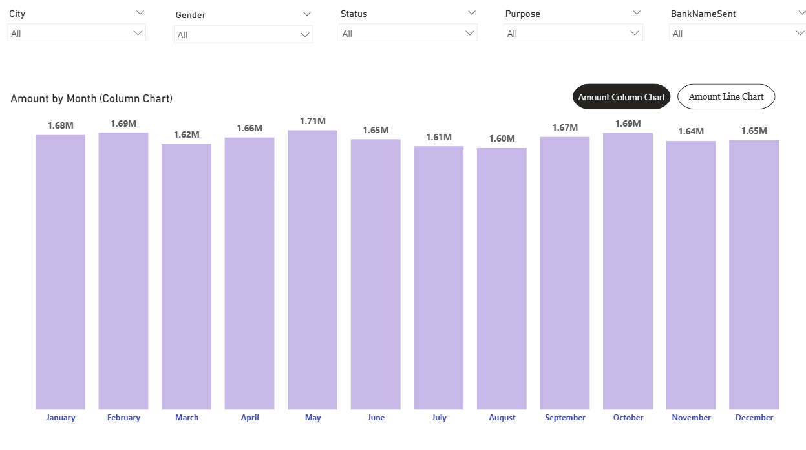
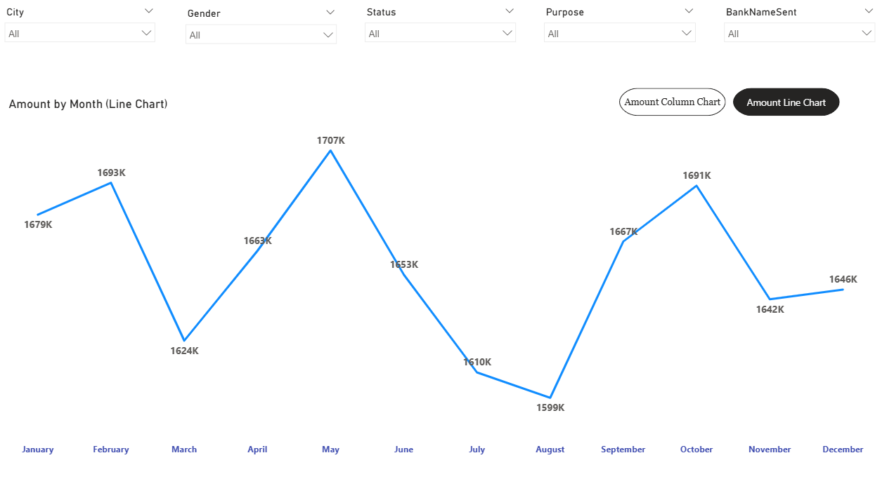
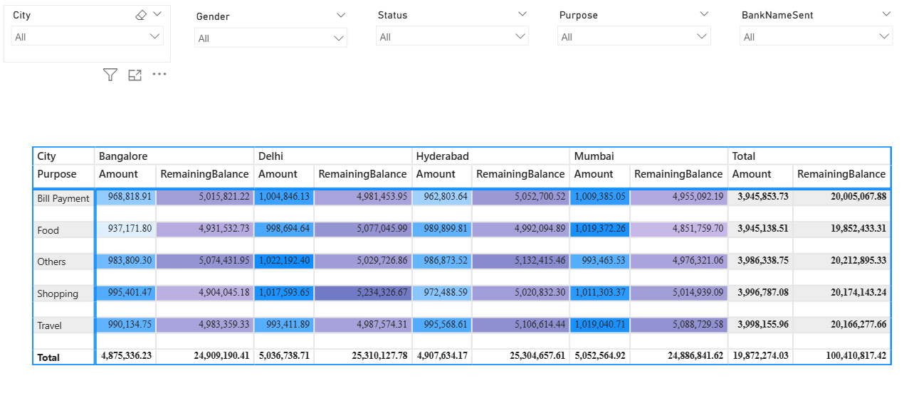

# Power-BI-Project-3-UPI-Transactions-Data-Analysis
Power BI Project 3: UPI Transactions Data Analysis with synced slicers, conditional formatting, bookmarks, and interactive navigation.

## Overview
This project analyzes UPI transaction data in Power BI and focuses on data preparation, synchronized filtering, conditional formatting, bookmarks, and interactive report navigation.

## Tools Used
- Power BI
- CSV

## Dataset
The dataset used in this project is included in the repository as `UPI Transactions.csv`.

## Project Files
- Power BI report: `Power BI Project 3, UPI Transactions Data Analysis.pbix`
- Source dataset: `UPI+Transactions.csv`

## Data Preparation
The data preparation phase included checking data types, reviewing the structure of the dataset, and applying necessary transformations.

One important transformation was splitting the `TransactionTime` field into separate **Date** and **Time** columns to support time-based analysis more effectively.

## Report Design
The report was built across multiple pages with interactive visuals and slicers.

### Synchronized Slicers
The same slicers were used across both report pages. By using **Sync Slicers**, selections made on one page can also apply to the other page, providing a more consistent filtering experience.

### Conditional Formatting
Conditional formatting was applied to the matrix visual so that numerical values are displayed with different colors based on their magnitude. This makes it easier to identify higher and lower values visually.

### Bookmarks and Navigation
Bookmarks were added to switch between two views of monthly transaction analysis:
- **Amount by Month (Column Chart)**
- **Amount by Month (Line Chart)**

A navigator was also added to let users switch between these bookmarked views more easily.

## Dashboard Views

### 1. Amount by Month - Column Chart
A column chart was used to show monthly transaction amounts and compare values across the year.

### 2. Amount by Month - Line Chart
A line chart was used to display the monthly transaction trend over time.

### 3. Matrix Analysis by City and Purpose
A matrix visual was used to compare transaction-related numerical values across cities and purposes. Conditional formatting was applied to highlight differences in magnitude.

## Acknowledgment
This project is based on **Section 25: Power BI Project 3, UPI Transactions Data Analysis** from the Udemy course **Complete Data Analyst Bootcamp From Basics To Advanced**.

The implementation, report building, and documentation in this repository were completed by me as part of my learning and portfolio work.
